# Hello World 🌏

I am a full-time Android Developer and part-time Content Creator in MikkiPastel. I have started Android Development since the internship and develop some applications to join some contest to get more experience then my goals are made application to solve user problem, answer business and improve myself to share knowledge in my blog. 

🌱 In addition to Android Development, I am interest in Programming, Design, Blockchain, Chatbot, Business & Innovation.

## 📫 Social

## 📖 Latest Blog ([mikkipastel.com](https://www.mikkipastel.com/))
<!-- BLOG:START -->
- [สร้าง workflow ง่าย ๆ ผ่าน Google Workspace Studio](https://www.mikkipastel.com/create-workflow-google-workspace-studio/)
- [3 ขั้นตอนเอา Jetpack Compose มาใช้ในโปรเจกต์เดิม](https://www.mikkipastel.com/3-step-to-add-jetpack-compose-to-your-android-project/)
- [วิวัฒนาการของคอมพิวเตอร์มีกี่ยุคบ้าง? แล้วทำอย่างไรให้คอมคุยกับคนรู้เรื่อง?](https://www.mikkipastel.com/friends-of-figma-bangkok-from-hci-to-ux-ui/)
- [เมื่อ AI เข้ามา ยังไงงานของเดฟก็ไม่เปลี่ยนไป สรุปจาก National Coding Day 2026](https://www.mikkipastel.com/national-coding-day-2026/)
- [4 ขั้นตอนในการ inspect หน้า WebView ในแอพ Android แบบง่ายมาก ๆ](https://www.mikkipastel.com/how-to-inspect-webview-in-android-app/)
<!-- BLOG:END -->

## 📖 Latest Blog ([medium.com](https://medium.com/@minseobingsu))
<!-- MEDIUM:START -->
- [สรุป Training Class ประจำปี กับการเรียน “Designing your Personal Brand”](https://developers.ascendcorp.com/2025-learn-and-grow-program-designing-your-personal-brand-6bc636354f33?source=rss-606b11313ec7------2)
- [มาฟังเบื้องหลังการซื้อ carbon credit ผ่าน TrueMoney กัน](https://developers.ascendcorp.com/integrating-carbon-offsets-into-consumer-focused-truemoney-carbonmark-4a40059713f0?source=rss-606b11313ec7------2)
- [เขียนแอพแอนดรอยด์ตั้งแต่เริ่มต้น ตอนที่ 2 : Activity &amp; Fragment](https://developers.ascendcorp.com/basic-android-development-ep-2-activity-44e335020e8b?source=rss-606b11313ec7------2)
- [มาเพิ่ม Skill ของ Android Developer ด้วยการทำ Android Library กันเถอะ](https://developers.ascendcorp.com/level-up-with-android-library-for-android-developer-c80ab0c3c346?source=rss-606b11313ec7------2)
- [เขียนแอพแอนดรอยด์ตั้งแต่เริ่มต้น ตอนที่ 1 : Introduction with Android Project](https://developers.ascendcorp.com/basic-android-development-ep-1-introduction-with-android-project-fbf754bb4d3a?source=rss-606b11313ec7------2)
<!-- MEDIUM:END -->

## 📺 Latest YouTube Videos ([youtube.com](https://www.youtube.com/@MikkiPastel))
<!-- YOUTUBE:START -->
- [[Vlog] เมื่อ AI เข้ามา ยังไงงานของเดฟก็ไม่เปลี่ยนไป สรุปจาก National Coding Day 2026](https://www.youtube.com/watch?v=PBS3KwxQaGU)
- [ทำงานที่มืดไม่แสบตาแล้ว กับ BenQ ScreenBar Halo 2](https://www.youtube.com/shorts/2v8ryZSnNkc)
- [แจก guideline ปั้นแอพ AI ด้วย Firebase + Vercel SDK](https://www.youtube.com/shorts/Z67iIriFjoE)
- [สรุป AI เจนรูปจากบ้าน Google มีกี่ตัว ต่างกันยังไง ราคาเท่าไหร่?](https://www.youtube.com/shorts/CYtVkzf7MP8)
- [อัพเดตบ้าน Meta ปี 2025 มีอะไรบ้าง?](https://www.youtube.com/shorts/LWNVNmW3b3A)
<!-- YOUTUBE:END -->

## 💻 My Tech Stack

#### Android Development

#### Web Development

#### Other

## 📈 Github Stat

## 🧧 Donate me

